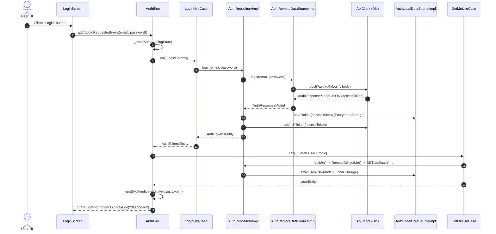
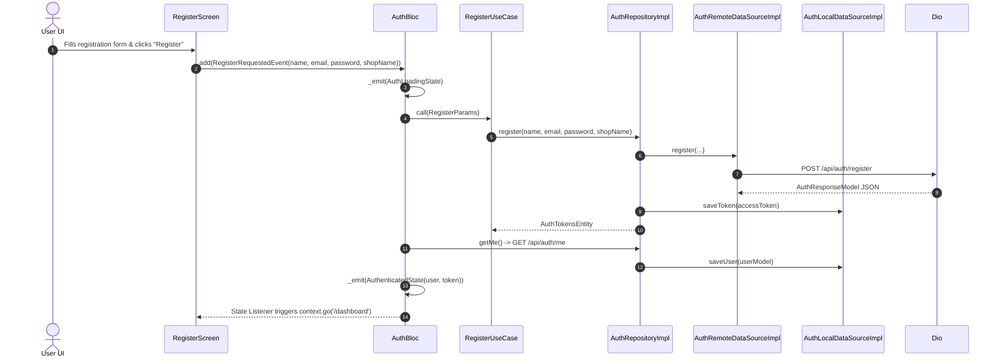
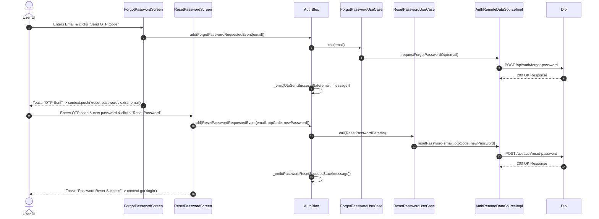
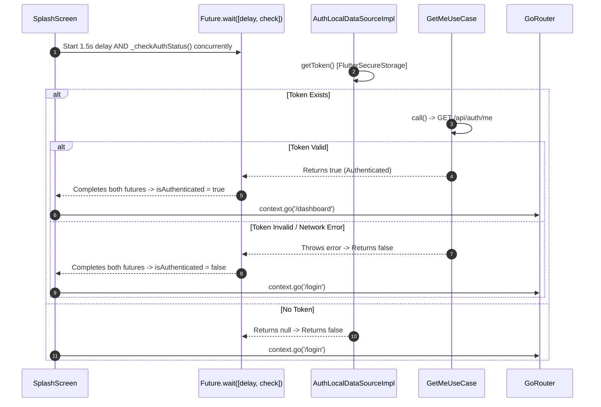
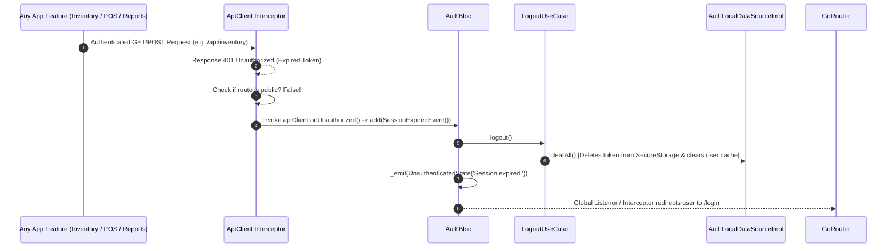

# 🔐 Authentication Feature Documentation (`lib/features/auth/`)

This directory contains the production-grade **Authentication Module** built with **Clean Architecture**, **BLoC State Management**, **Dio HTTP Engine**, and **Hardware-Backed Encrypted Token Persistence (`FlutterSecureStorage`)**.

---

## 📐 Architecture & Layer Breakdown

The feature follows strict **Clean Architecture** principles, ensuring that Business Logic (Domain) remains pure and decoupled from Frameworks (Flutter UI, Dio HTTP, Local Persistence).

```
lib/features/auth/
├── domain/                          # 🧠 Pure Business Logic Layer (Framework-Independent)
│   ├── entities/                    # Business Objects
│   │   ├── user_entity.dart         # User & Subscription domain entity
│   │   └── auth_tokens_entity.dart  # JWT Token domain entity
│   ├── repositories/                # Repository Interface Contract
│   │   └── auth_repository.dart     # Abstract interface for Auth operations
│   └── usecases/                    # Single-Responsibility UseCases
│       ├── login_usecase.dart       # Executes User Login
│       ├── register_usecase.dart    # Executes Shop Owner Registration
│       ├── forgot_password_usecase.dart # Requests 6-digit OTP code
│       ├── reset_password_usecase.dart  # Resets password using OTP code
│       ├── get_me_usecase.dart      # Fetches active user profile
│       └── logout_usecase.dart      # Wipes token and session data
│
├── data/                            # 💾 Data & Network Communication Layer
│   ├── models/                      # DTOs (Data Transfer Objects for JSON)
│   │   ├── user_model.dart          # JSON DTO for User Profile & Subscription
│   │   └── auth_response_model.dart # JSON DTO for Token response
│   ├── mappers/                     # Model <-> Entity Translators
│   │   └── auth_mapper.dart         # Maps DTO Models to Domain Entities
│   ├── datasources/                 # Data Providers
│   │   ├── auth_remote_data_source.dart # Calls REST API via Dio ApiClient
│   │   └── auth_local_data_source.dart  # Persists tokens via FlutterSecureStorage & SharedPreferences
│   └── repositories/                # Repository Implementation
│       └── auth_repository_impl.dart# Orchestrates Remote/Local Data Sources & Mappers
│
└── presentation/                    # 🎨 UI & State Management Layer
    ├── bloc/                        # Business Logic Component
    │   ├── auth_event.dart          # UI Triggers (Login, Register, OTP, Reset, GetMe, Logout)
    │   ├── auth_state.dart          # UI States (Initial, Loading, Authenticated, Unauthenticated, Failure)
    │   └── auth_bloc.dart           # BLoC Controller & 401 Interceptor Listener
    └── view/                        # Flutter Screens
        ├── login_screen.dart        # Login Screen UI connected to AuthBloc
        ├── register_screen.dart     # Shop Owner Registration Screen UI
        ├── forgot_password_screen.dart # OTP Request Screen UI
        └── reset_password_screen.dart  # OTP Verification & New Password Screen UI
```

---

## 🌐 Target REST API Endpoints

| Method | Endpoint | Description | Headers | Auth Required |
| :--- | :--- | :--- | :--- | :--- |
| `POST` | `/api/auth/login` | Login and receive Bearer JWT token | `Content-Type: application/json` | ❌ Public |
| `POST` | `/api/auth/register` | Register new Shop Owner (Admin) account | `Content-Type: application/json` | ❌ Public |
| `POST` | `/api/auth/forgot-password` | Request 6-digit OTP code for password reset | `Content-Type: application/json` | ❌ Public |
| `POST` | `/api/auth/reset-password` | Reset password using 6-digit OTP code | `Content-Type: application/json` | ❌ Public |
| `GET` | `/api/auth/me` | Fetch active user profile & subscription | `Authorization: Bearer <token>` | ✅ Authenticated |

---

## 🔄 Detailed Method Call Execution Flows

### 1️⃣ User Login Flow



**Step-by-step Method Call Sequence:**
1. User enters email & password on `LoginScreen` and presses **Login**.
2. `LoginScreen` dispatches `LoginRequestedEvent(email, password)` to `AuthBloc`.
3. `AuthBloc` emits `AuthLoadingState()`.
4. `AuthBloc` calls `LoginUseCase.call(LoginParams(email, password))`.
5. `LoginUseCase` calls `AuthRepositoryImpl.login(email, password)`.
6. `AuthRepositoryImpl` delegates to `AuthRemoteDataSourceImpl.login(...)`.
7. `AuthRemoteDataSourceImpl` invokes `ApiClient.post(ApiEndpoints.login, body: {...}, isPublic: true)`.
8. Dio executes the HTTP POST request to `/api/auth/login` and receives the JSON response containing the Bearer token.
9. `AuthResponseModel.fromJson(json)` parses the DTO response.
10. `AuthRepositoryImpl` saves the token via `AuthLocalDataSource.saveToken(token)` into `FlutterSecureStorage` (hardware encrypted).
11. `AuthRepositoryImpl` updates `ApiClient.setAuthToken(token)` for future authenticated API headers.
12. `AuthBloc` invokes `GetMeUseCase()` to fetch the authenticated user profile (`GET /api/auth/me`).
13. `AuthLocalDataSource.saveUser(userModel)` caches the user profile locally.
14. `AuthBloc` emits `AuthenticatedState(user: userEntity, token: token)`.
15. `LoginScreen` listens to `AuthenticatedState` and navigates to `/dashboard`.

---

### 2️⃣ Shop Owner Registration Flow



---

### 3️⃣ Forgot Password & OTP Flow



---

### 4️⃣ Splash Screen Auto-Authentication Check Flow



**Why `Future.wait` is used:**
- Executes the **1.5-second visual splash delay** and **`GET /api/auth/me` network verification** concurrently in parallel.
- Prevents UI flashing if the network is fast.
- Waits gracefully for slow network responses before making navigation decisions.

---

### 5️⃣ Global 401 Unauthorized Interceptor & Auto Logout Flow



**Loop Safety Protocol:**
- Public endpoints (`/api/auth/login`, `/api/auth/register`, `/api/auth/forgot-password`, `/api/auth/reset-password`) are marked with `isPublic: true`.
- If a public endpoint returns 401 (e.g. invalid login credentials), the 401 Interceptor **ignores** `onUnauthorized` and passes the error to the UI as `AuthFailureState("Invalid credentials")`.
- Only authenticated routes trigger automatic session expiration, eliminating infinite redirect loops!

---

## 🔒 Security & Local Data Storage Architecture

### 1. Token Storage (`FlutterSecureStorage`)
- **Android Implementation**: `AndroidOptions(encryptedSharedPreferences: true)` — Uses **Android Keystore** hardware-backed AES encryption.
- **iOS Implementation**: `IOSOptions(accessibility: KeychainAccessibility.first_unlock)` — Uses **iOS Keychain** Secure Enclave.
- **Purpose**: Protects Bearer JWT Access Tokens against extraction on rooted or jailbroken devices.

### 2. User Profile Caching (`SharedPreferences` & In-Memory Cache)
- Caches the `UserModel` JSON DTO locally.
- Provides synchronous, zero-latency profile reading across the app (e.g. displaying user avatar initials and email in `AppDrawer`).

---

## 💡 Developer Usage Guide

### How to Access the Logged-in User in Any Widget / Screen

#### Method 1: Asynchronous Local Read
```dart
final user = await InjectionContainer.authRepository.getSavedUser();
print('Logged in user: ${user?.name}, Email: ${user?.email}');
```

#### Method 2: Current BLoC State Check
```dart
final state = InjectionContainer.authBloc.state;
if (state is AuthenticatedState) {
  final user = state.user;
  final token = state.token;
}
```

#### Method 3: Live Server Profile Refresh
```dart
final user = await InjectionContainer.getMeUseCase();
```

---

## 🧪 Error & Failure Handling Standard

| Failure Type | Description | Trigger Scenario |
| :--- | :--- | :--- |
| `ServerFailure` | Backend returned HTTP 400/500 | Bad request payload, validation error, server crash |
| `NetworkFailure` | No connection / timeout | SocketException, Dio connection timeout |
| `UnauthorizedFailure` | 401 Session Expired | Token expired, invalid token signature |
| `CacheFailure` | Local read/write issue | SharedPreferences or Keychain read error |
