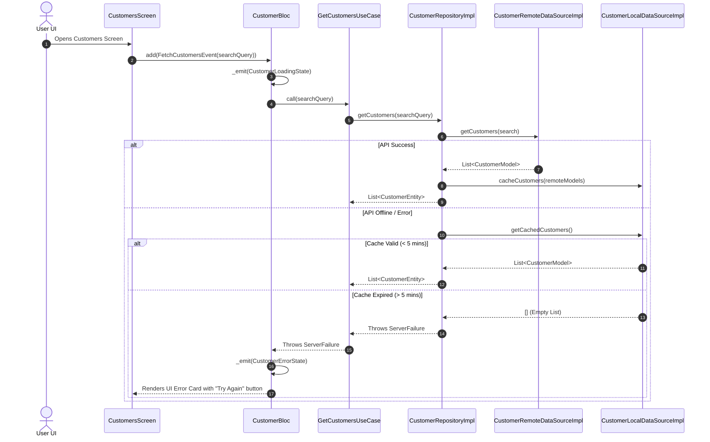

# 👥 Customers Feature Documentation (`lib/features/customers/`)

This directory contains the production-grade **Customers Module** built with **Clean Architecture**, **BLoC State Management**, **Dio HTTP Engine**, and **5-Minute TTL RAM Cache Purge**.

---

## 📐 Architecture & Layer Breakdown

```
lib/features/customers/
├── domain/                          # 🧠 Pure Business Logic Layer
│   ├── entities/
│   │   └── customer_entity.dart     # Customer Domain Entity (Name, Phone, Address, Dues)
│   ├── repositories/
│   │   └── customer_repository.dart # Abstract Interface Contract
│   └── usecases/
│       ├── get_customers_usecase.dart # Fetches customers list
│       ├── add_customer_usecase.dart  # Adds new customer (Free Tier Limit: Max 1)
│       ├── update_customer_usecase.dart# Updates customer details
│       └── delete_customer_usecase.dart# Soft-deletes customer
│
├── data/                            # 💾 Data Communication Layer
│   ├── models/
│   │   └── customer_model.dart      # JSON DTO for REST API
│   ├── mappers/
│   │   └── customer_mapper.dart     # Translates DTO <-> Domain Entity
│   ├── datasources/
│   │   ├── customer_remote_data_source.dart # REST API (Dio)
│   │   └── customer_local_data_source.dart  # 5-Min TTL In-memory Cache
│   └── repositories/
│       └── customer_repository_impl.dart    # CustomerRepository Implementation
│
└── presentation/                    # 🎨 UI & State Management Layer
    └── bloc/
        ├── customer_event.dart      # BLoC Events (Fetch, Add, Update, Delete)
        ├── customer_state.dart      # BLoC States (Initial, Loading, Loaded, Error)
        └── customer_bloc.dart       # Customer BLoC Controller
```

---

## 🌐 Target REST API Endpoints

| Method | Endpoint | Description | Auth Required |
| :--- | :--- | :--- | :--- |
| `GET` | `/api/customers` | Fetch customers list (supports `?search=`) | ✅ Authenticated |
| `POST` | `/api/customers` | Create new customer (Free Tier: Max 1 customer) | ✅ Authenticated |
| `POST` | `/api/customers/:id` | Update existing customer details | ✅ Authenticated |
| `POST` | `/api/customers/:id/delete` | Soft-delete customer (`isDeleted: true`) | ✅ Authenticated |

---

## 🔄 Sequence & Execution Flows


