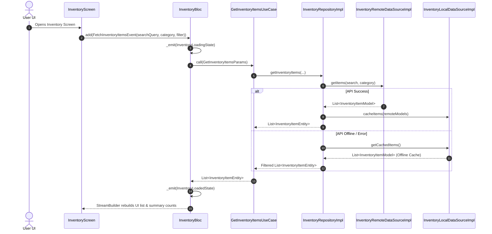

# 📦 Inventory Feature Documentation (`lib/features/inventory/`)

This directory contains the production-grade **Inventory / Product Management Module** built with **Clean Architecture**, **BLoC State Management**, **Dio HTTP Engine**, and **Local Offline Caching**.

---

## 📐 Architecture & Layer Breakdown

```
lib/features/inventory/
├── domain/                          # 🧠 Pure Business Logic Layer
│   ├── entities/
│   │   └── inventory_item_entity.dart # Inventory Item Domain Entity
│   ├── repositories/
│   │   └── inventory_repository.dart  # Abstract Interface Contract
│   └── usecases/
│       ├── get_inventory_items_usecase.dart # Fetches item list
│       ├── add_inventory_item_usecase.dart  # Adds new item
│       ├── update_inventory_item_usecase.dart# Updates item
│       └── delete_inventory_item_usecase.dart# Soft-deletes item
│
├── data/                            # 💾 Data Communication Layer
│   ├── models/
│   │   └── inventory_item_model.dart  # JSON DTO for REST API
│   ├── mappers/
│   │   └── inventory_mapper.dart      # Translates DTO <-> Domain Entity
│   ├── datasources/
│   │   ├── inventory_remote_data_source.dart # REST API (Dio)
│   │   └── inventory_local_data_source.dart  # In-memory Cache & Fallback
│   └── repositories/
│       └── inventory_repository_impl.dart # InventoryRepository Implementation
│
└── presentation/                    # 🎨 UI & State Management Layer
    ├── bloc/
    │   ├── inventory_event.dart       # BLoC Events (Fetch, Add, Update, Delete)
    │   ├── inventory_state.dart       # BLoC States (Initial, Loading, Loaded, Error)
    │   └── inventory_bloc.dart        # Inventory BLoC Controller
    ├── view/
    │   └── inventory_screen.dart      # Flutter UI Screen connected to BLoC
    └── widget/
        ├── inventory_item_card.dart   # Item Display Card
        ├── inventory_add_item_bottom_sheet.dart # Add/Edit Modal Sheet
        ├── inventory_summery.dart     # Stock Summary Header (Low/Out of Stock)
        └── inventory_empty_state.dart # Empty State Display
```

---

## 🌐 Target REST API Endpoints

| Method | Endpoint | Description | Auth Required |
| :--- | :--- | :--- | :--- |
| `GET` | `/api/items` | Fetch inventory items list (supports `?search=` and `?category=`) | ✅ Authenticated |
| `POST` | `/api/items` | Create new inventory item (max 5 items for free tier) | ✅ Authenticated |
| `POST` | `/api/items/:id` | Update existing inventory item | ✅ Authenticated |
| `POST` | `/api/items/:id/delete` | Soft-delete inventory item (`isDeleted: true`) | ✅ Authenticated |

---

## 🔄 Sequence & Execution Flows

### Item Fetching & Search Sequence


