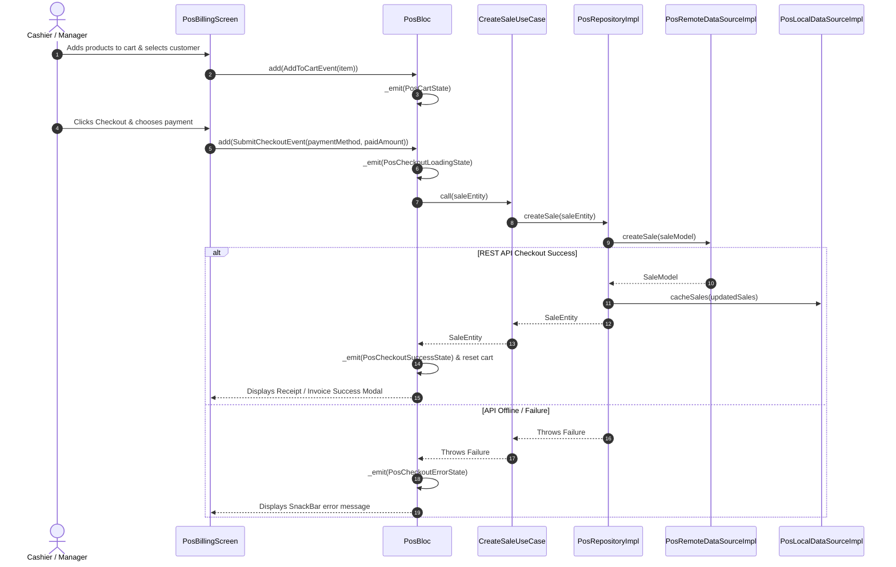

# 🛒 POS Billing & Sales Feature Documentation (`lib/features/posbilling/`)

This directory contains the production-grade **POS Billing & Sales Module** built with **Clean Architecture**, **BLoC State Management**, **Dio HTTP Engine**, and **5-Minute TTL RAM Cache Purge**.

---

## 📐 Architecture & Layer Breakdown

```
lib/features/posbilling/
├── domain/                          # 🧠 Pure Business Logic Layer
│   ├── entities/
│   │   ├── cart_item_entity.dart    # Cart Item Domain Entity
│   │   └── sale_entity.dart         # Sale Transaction Domain Entity
│   ├── repositories/
│   │   └── pos_repository.dart      # Abstract Interface Contract
│   └── usecases/
│       ├── create_sale_usecase.dart # Submits checkout transaction
│       └── get_sales_logs_usecase.dart# Fetches sales history logs
│
├── data/                            # 💾 Data Communication Layer
│   ├── models/
│   │   ├── cart_item_model.dart     # JSON DTO for Cart Items
│   │   └── sale_model.dart          # JSON DTO for Sale Transactions
│   ├── mappers/
│   │   └── pos_mapper.dart          # Translates DTO <-> Domain Entity
│   ├── datasources/
│   │   ├── pos_remote_data_source.dart # REST API (Dio)
│   │   └── pos_local_data_source.dart  # 5-Min TTL In-memory Cache
│   └── repositories/
│       └── pos_repository_impl.dart    # PosRepository Implementation
│
└── presentation/                    # 🎨 UI & State Management Layer
    └── bloc/
        ├── pos_event.dart           # BLoC Events (AddToCart, RemoveItem, SubmitCheckout, ClearCart)
        ├── pos_state.dart           # BLoC States (CartState, CheckoutLoading, CheckoutSuccess, Error)
        └── pos_bloc.dart            # POS Billing BLoC Controller
```

---

## 🌐 Target REST API Endpoints

| Method | Endpoint | Description | Auth Required |
| :--- | :--- | :--- | :--- |
| `POST` | `/api/sales` | Submit new sale transaction (Free Tier: Max 5 sales) | ✅ Authenticated |
| `GET` | `/api/sales` | Fetch sales transaction history logs | ✅ Authenticated |

---

## 🔄 Sequence & Execution Flows


