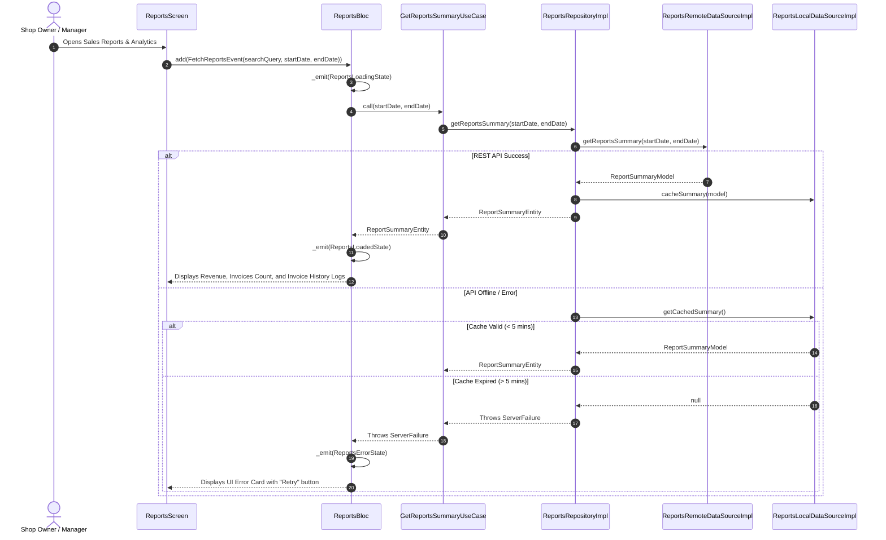

# 📊 Reports & Sales Analytics Feature Documentation (`lib/features/reports/`)

This directory contains the production-grade **Reports & Sales Analytics Module** built with **Clean Architecture**, **BLoC State Management**, **Dio HTTP Engine**, and **5-Minute TTL RAM Cache Purge**.

---

## 📐 Architecture & Layer Breakdown

```
lib/features/reports/
├── domain/                          # 🧠 Pure Business Logic Layer
│   ├── entities/
│   │   └── report_summary_entity.dart # Sales Summary Entity (Revenue, Invoices, Dues)
│   ├── repositories/
│   │   └── reports_repository.dart  # Abstract Interface Contract
│   └── usecases/
│       ├── get_reports_summary_usecase.dart # Fetches summary metrics
│       └── get_invoice_logs_usecase.dart    # Fetches sales invoice logs
│
├── data/                            # 💾 Data Communication Layer
│   ├── models/
│   │   └── report_summary_model.dart# JSON DTO for Analytics
│   ├── mappers/
│   │   └── reports_mapper.dart      # Translates DTO <-> Domain Entity
│   ├── datasources/
│   │   ├── reports_remote_data_source.dart # REST API (Dio)
│   │   └── reports_local_data_source.dart  # 5-Min TTL In-memory Cache
│   └── repositories/
│       └── reports_repository_impl.dart    # ReportsRepository Implementation
│
└── presentation/                    # 🎨 UI & State Management Layer
    └── bloc/
        ├── reports_event.dart       # BLoC Events (FetchReports, FilterByDateRange, SearchInvoice)
        ├── reports_state.dart       # BLoC States (Initial, Loading, Loaded, Error)
        └── reports_bloc.dart        # Reports BLoC Controller
```

---

## 🌐 Target REST API Endpoints

| Method | Endpoint | Description | Auth Required |
| :--- | :--- | :--- | :--- |
| `GET` | `/api/reports/summary` | Fetch gross revenue, total sales, dues & discounts summary | ✅ Authenticated |
| `GET` | `/api/sales` | Fetch sales invoice transaction logs (supports date & search filters) | ✅ Authenticated |

---

## 🔄 Sequence & Execution Flows


