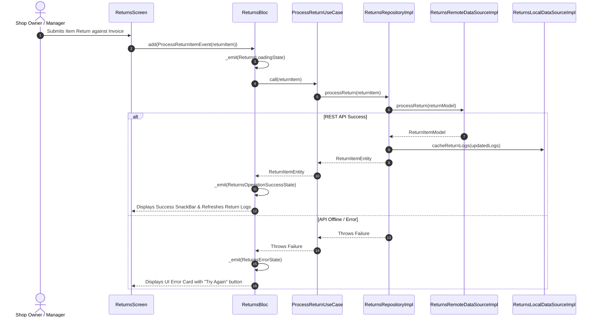

# 🔄 Returns & Restock Feature Documentation (`lib/features/returnandrestoke/`)

This directory contains the production-grade **Returns & Restock Module** built with **Clean Architecture**, **BLoC State Management**, **Dio HTTP Engine**, and **5-Minute TTL RAM Cache Purge**.

---

## 📐 Architecture & Layer Breakdown

```
lib/features/returnandrestoke/
├── domain/                          # 🧠 Pure Business Logic Layer
│   ├── entities/
│   │   └── return_item_entity.dart  # Return Item Domain Entity
│   ├── repositories/
│   │   └── returns_repository.dart  # Abstract Interface Contract
│   └── usecases/
│       ├── process_return_usecase.dart # Processes item return & restocks inventory
│       └── get_return_logs_usecase.dart# Fetches return transaction logs
│
├── data/                            # 💾 Data Communication Layer
│   ├── models/
│   │   └── return_item_model.dart   # JSON DTO for Return Transactions
│   ├── mappers/
│   │   └── returns_mapper.dart      # Translates DTO <-> Domain Entity
│   ├── datasources/
│   │   ├── returns_remote_data_source.dart # REST API (Dio)
│   │   └── returns_local_data_source.dart  # 5-Min TTL In-memory Cache
│   └── repositories/
│       └── returns_repository_impl.dart    # ReturnsRepository Implementation
│
└── presentation/                    # 🎨 UI & State Management Layer
    └── bloc/
        ├── returns_event.dart       # BLoC Events (FetchReturnLogs, ProcessReturnItem)
        ├── returns_state.dart       # BLoC States (Initial, Loading, Loaded, Error)
        └── returns_bloc.dart        # Returns BLoC Controller
```

---

## 🌐 Target REST API Endpoints

| Method | Endpoint | Description | Auth Required |
| :--- | :--- | :--- | :--- |
| `POST` | `/api/returns` | Process item return & restock inventory | ✅ Authenticated |
| `GET` | `/api/returns` | Fetch return transaction logs history | ✅ Authenticated |

---

## 🔄 Sequence & Execution Flows


