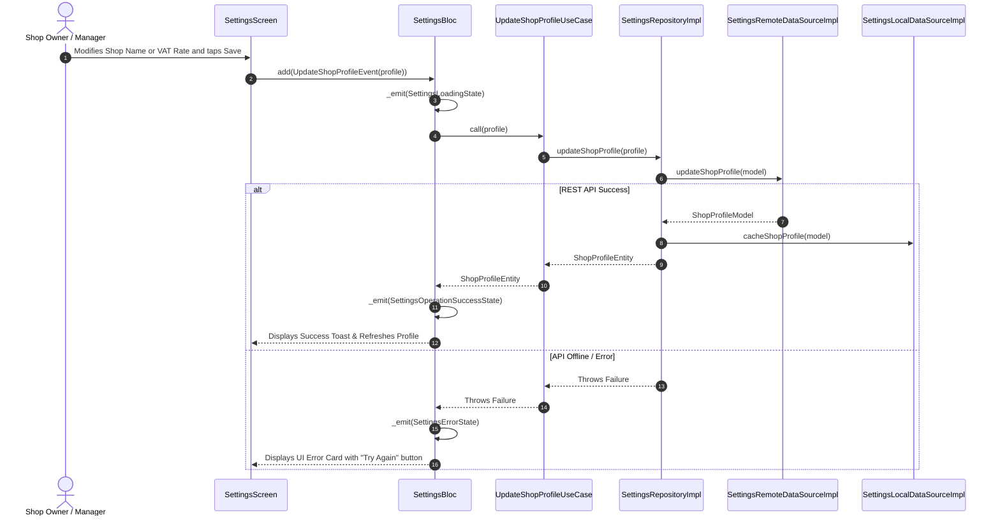

# ⚙️ Shop Settings & Subscription Feature Documentation (`lib/features/settings/`)

This directory contains the production-grade **Shop Settings & Subscription Management Module** built with **Clean Architecture**, **BLoC State Management**, **Dio HTTP Engine**, and **5-Minute TTL RAM Cache Purge**.

---

## 📐 Architecture & Layer Breakdown

```
lib/features/settings/
├── domain/                          # 🧠 Pure Business Logic Layer
│   ├── entities/
│   │   ├── shop_profile_entity.dart # Shop Profile Domain Entity
│   │   └── subscription_entity.dart # Subscription Tier Domain Entity
│   ├── repositories/
│   │   └── settings_repository.dart # Abstract Interface Contract
│   └── usecases/
│       ├── get_shop_profile_usecase.dart   # Fetches shop profile settings
│       ├── update_shop_profile_usecase.dart# Updates shop details & VAT
│       └── upgrade_subscription_usecase.dart# Upgrades subscription tier
│
├── data/                            # 💾 Data Communication Layer
│   ├── models/
│   │   ├── shop_profile_model.dart  # JSON DTO for Shop Profile
│   │   └── subscription_model.dart  # JSON DTO for Subscription
│   ├── mappers/
│   │   └── settings_mapper.dart     # Translates DTO <-> Domain Entity
│   ├── datasources/
│   │   ├── settings_remote_data_source.dart # REST API (Dio)
│   │   └── settings_local_data_source.dart  # 5-Min TTL In-memory Cache
│   └── repositories/
│       └── settings_repository_impl.dart    # SettingsRepository Implementation
│
└── presentation/                    # 🎨 UI & State Management Layer
    ├── bloc/
    │   ├── settings_event.dart      # BLoC Events (FetchSettings, UpdateShopProfile, UpgradeSubscription)
    │   ├── settings_state.dart      # BLoC States (Initial, Loading, Loaded, Error)
    │   └── settings_bloc.dart       # Settings BLoC Controller
```

---

## 🌐 Target REST API Endpoints

| Method | Endpoint | Description | Auth Required |
| :--- | :--- | :--- | :--- |
| `GET` | `/api/shop/profile` | Fetch shop details & settings | ✅ Authenticated |
| `POST` | `/api/shop/profile` | Update shop name, phone, address, currency, VAT rate | ✅ Authenticated |
| `GET` | `/api/subscription/status` | Fetch subscription tier & usage limits | ✅ Authenticated |
| `POST` | `/api/subscription/upgrade` | Upgrade subscription tier | ✅ Authenticated |

---

## 🔄 Sequence & Execution Flows


