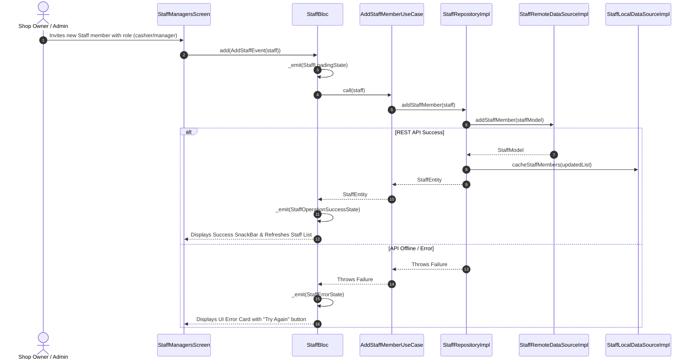

# 👥 Staff & Role Management Feature Documentation (`lib/features/staff_managers/`)

This directory contains the production-grade **Staff & Role Management Module** built with **Clean Architecture**, **BLoC State Management**, **Dio HTTP Engine**, and **5-Minute TTL RAM Cache Purge**.

---

## 📐 Architecture & Layer Breakdown

```
lib/features/staff_managers/
├── domain/                          # 🧠 Pure Business Logic Layer
│   ├── entities/
│   │   └── staff_entity.dart        # Staff Member Domain Entity
│   ├── repositories/
│   │   └── staff_repository.dart    # Abstract Interface Contract
│   └── usecases/
│       ├── get_staff_members_usecase.dart  # Fetches list of staff
│       ├── add_staff_member_usecase.dart   # Adds new staff member
│       ├── update_staff_member_usecase.dart# Updates staff role/status
│       └── delete_staff_member_usecase.dart# Deletes staff member
│
├── data/                            # 💾 Data Communication Layer
│   ├── models/
│   │   └── staff_model.dart         # JSON DTO for Staff Member
│   ├── mappers/
│   │   └── staff_mapper.dart        # Translates DTO <-> Domain Entity
│   ├── datasources/
│   │   ├── staff_remote_data_source.dart # REST API (Dio)
│   │   └── staff_local_data_source.dart  # 5-Min TTL In-memory Cache
│   └── repositories/
│       └── staff_repository_impl.dart    # StaffRepository Implementation
│
└── presentation/                    # 🎨 UI & State Management Layer
    └── bloc/
        ├── staff_event.dart         # BLoC Events (FetchStaff, AddStaff, UpdateStaff, DeleteStaff)
        ├── staff_state.dart         # BLoC States (Initial, Loading, Loaded, Error)
        └── staff_bloc.dart          # Staff BLoC Controller
```

---

## 🌐 Target REST API Endpoints

| Method | Endpoint | Description | Auth Required |
| :--- | :--- | :--- | :--- |
| `GET` | `/api/staff` | Fetch list of shop staff members | ✅ Authenticated |
| `POST` | `/api/staff` | Add/Invite new staff member with assigned role | ✅ Authenticated |
| `PUT` | `/api/staff/:id` | Update staff member role or active status | ✅ Authenticated |
| `DELETE` | `/api/staff/:id` | Remove/Revoke staff member access | ✅ Authenticated |

---

## 🔄 Sequence & Execution Flows


